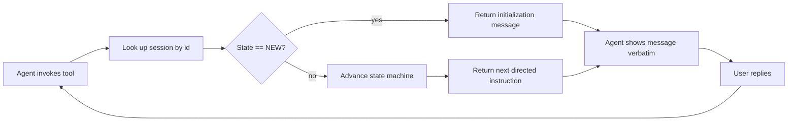

# ConsafeWorkflow.Mcp

A **stateful workflow MCP server** for Copilot agents. It is designed to act as a
directed workflow engine: instead of baking workflow instructions into agent prompts,
the agent calls a single MCP tool on every turn and presents the tool's response to
the user **verbatim**. The server owns the state machine and decides what comes next.

> **Status: first workflow live.** The structure, IDE integration and input handling are in
> place. A real engine (`ComponentWorkflowEngine`) is **gated**: the user types `menu` to
> start (anything else is answered with a reminder), then picks an option. "Create a
> component" runs a pattern → name → confirm flow that hands Copilot a scaffold instruction;
> other options finish locally. Choice steps list their options in the message text **and**
> in `WorkflowStep.Choices` (rendered as a single-select dropdown when answered via
> elicitation). The local model is still mocked (`MockLocalModelClient`). `StubWorkflowEngine`
> remains as a minimal reference.

## How it works

When an agent invokes the tool:

1. The server looks up the session state by **session id**.
2. If the state is **NEW**, it returns an initialization message (e.g. the first
   question to ask the user).
3. If the state is **established**, it advances the state machine and returns the next
   directed instruction (the next question, or a command to run).
4. The tool output is a **directed message** the agent must present to the user
   verbatim — this replaces prompt-based workflow instructions entirely.



## The tool

| Tool | Parameters | Returns |
| --- | --- | --- |
| `get_next_step` | `sessionId: string`, `userInput: string` | Directed message string |

- `sessionId` — a stable identifier for the conversation.
- `userInput` — the user's latest input; pass an empty string on the first call.

> **Input does not come from `userInput`.** The MCP server only receives what the agent
> (LLM) chooses to pass in `userInput`; it **cannot read the chat box directly** — there is
> no MCP call that hands the server the user's typed text. So `userInput` frequently arrives
> as IDE context (e.g. `Current file: ...`), a paraphrase, or **empty**, and can never be
> made 100% reliable. It is also model-dependent — some models forward the chat text, others
> send empty. So the tool uses a **hybrid**: if the agent forwarded a non-empty `userInput`,
> it is used; if it is empty, the server falls back to **elicitation** — it opens its own
> textbox, the user types the answer and presses Enter, and that value reaches the server
> **verbatim**, with no model in between. See
> [Reliable input via elicitation](#reliable-input-via-elicitation).

## How the user drives it in Visual Studio

The user selects the `My-Agent` agent (`@My-Agent`) and sends a message; the agent forwards
it to `get_next_step`. If the model relays the text, the workflow uses it directly; if the
model drops it (sends empty `userInput`), the server opens its own **textbox** so the answer
is never lost. Either way the user just types in chat — no slash-command to remember
(confirmed working on both claude-haiku-4.5 and GPT-5 mini).

## Reliable input via elicitation

Because tool arguments are generated by the model, you can't rely on the agent to relay
the user's literal words (or even a stable `sessionId`). The robust fix is **elicitation**
— the server requests input from the user, and the client renders the prompt and returns
the user's actual answer to the server, bypassing the agent. In this server elicitation is
the **primary** input path (the user always answers in our textbox), so the MCP owns the
workflow input end-to-end.

How `get_next_step` works each call:

1. It looks up the session and determines the **question** to put to the user: the one it
   posed last turn (`WorkflowSession.PendingPrompt`), or — for a brand-new session — the
   engine's `InitialPrompt`.
2. **If the client supports elicitation (primary path):** it calls `ElicitAsync(...)`
   showing that question, reads the user's typed `reply`, advances the engine with it, and
   returns the next directed message. This fires from the **very first** call.
3. **If the client doesn't support elicitation (fallback path):** it uses a two-phase
   loop — return the question for the agent to display on one turn, then advance with the
   (unreliable) agent-supplied `userInput` on the next. (`ElicitAsync` throws when the
   capability is absent, so the guard is required.)

> The elicited answer is the natural place to plug in the local model
> (`ILocalModelClient`) — e.g. normalise free text to a known choice or suggest a
> parameter value — before handing it to the engine.

Response-parsing notes (learned from real clients):

- The MCP spec uses `Action == "accept"`, but **Visual Studio sends `"accepted"`** and
  leaves `IsAccepted == false`. The parser accepts any `accept*` action (case-insensitive)
  or the `IsAccepted` flag.
- It reads the `reply` field, but falls back to the first usable string property if a
  client keys the value differently, and coerces non-string primitives via raw text.
- A `[elicit] raw response: action=… isAccepted=… content=…` line is logged to **stderr**
  on every elicitation so you can see exactly what a client returned (visible in the IDE's
  MCP/output panel).

Client support:

- **VS Code** documents elicitation support — you should see a prompt/dialog and the
  server will use your real answer.
- **Visual Studio** advertises the elicitation capability (its client reports a `Form`
  capability) and **does** render the dialog and return the typed value — note it sends
  `action="accepted"` (handled above). The tool is also hardened so that if a client
  advertises elicitation but never answers, the call **never throws** and **self-limits
  with a timeout**, degrading gracefully to `userInput` instead of hanging.

### Elicitation resilience & configuration

`ElicitReplyAsync` swallows every client/protocol error and applies a safety timeout, so
a client that advertises elicitation but never answers can't freeze the agent. Two
environment variables tune the behaviour (set them in the `"env"` block of `.mcp.json` /
`.vscode/mcp.json`):

| Variable | Default | Effect |
| --- | --- | --- |
| `CONSAFEWORKFLOW_DISABLE_ELICITATION` | _(unset)_ | Set to `1` to skip elicitation entirely and always use the agent-supplied `userInput`. Use this in Visual Studio if its elicitation UI misbehaves. |
| `CONSAFEWORKFLOW_ELICIT_TIMEOUT_SECONDS` | `120` | Max seconds to wait for the client's elicitation answer before falling back to `userInput`. Set `0` to wait indefinitely. |

> **If elicitation isn't working in Visual Studio**, set
> `CONSAFEWORKFLOW_DISABLE_ELICITATION=1` for a guaranteed-working (agent-mediated) path,
> and design the workflow engine to tolerate imperfect input — e.g. offer a fixed set of
> choices and re-ask when the answer doesn't match.

> Future engines can elicit **typed choices** (single/multi-select enums) instead of free
> text — e.g. "Repository vs CQRS" — which both improves UX and removes free-text
> ambiguity. The schema types live in `ModelContextProtocol.Protocol`
> (`StringSchema`, `BooleanSchema`, `UntitledSingleSelectEnumSchema`, …).

## Requirements

- [.NET SDK 10.0+](https://dotnet.microsoft.com/download)

## Build once, then run

The MCP registration (`.vscode/mcp.json`) launches the server with `--no-build` for a
fast startup, so you must build the project **once** before first use (and again after
code changes):

```bash
dotnet build ConsafeWorkflow.Mcp/ConsafeWorkflow.Mcp.csproj
```

Run it directly (useful for manual testing):

```bash
dotnet run --project ConsafeWorkflow.Mcp/ConsafeWorkflow.Mcp.csproj
```

The server communicates over **stdio** (JSON-RPC). All logging goes to **stderr**;
stdout is reserved for the MCP protocol.

## IDE integration (Visual Studio & VS Code)

The registration is shipped in **two files with identical content** so it works
cleanly in both IDEs as source-controlled config:

- **`.mcp.json`** (repo root) — Visual Studio's recommended source-controlled
  location (`<SOLUTIONDIR>\.mcp.json`).
- **`.vscode/mcp.json`** — VS Code's workspace location. (Visual Studio also reads
  this as a compatibility fallback, but its docs note it's "typically not source
  controlled," which is why we also ship `.mcp.json`.)

```json
{
  "servers": {
    "consafeworkflow": {
      "type": "stdio",
      "command": "dotnet",
      "args": ["run", "--project", "${workspaceFolder}/ConsafeWorkflow.Mcp/ConsafeWorkflow.Mcp.csproj", "--no-build"]
    }
  }
}
```

The project path uses the **`${workspaceFolder}`** variable, which both IDEs expand to
the opened solution/workspace root. This makes the path independent of the spawned
server's working directory (the IDE does **not** guarantee it's the repo root, which
otherwise causes a *"The provided file path does not exist"* startup error).
A `ConsafeWorkflow.slnx` solution is provided at the repo root — **open that solution
(or the repo folder), not the bare `.csproj`** (see Troubleshooting). The same file
works on every machine. Remember the one-time `dotnet build` above because of
`--no-build`.

> **Visual Studio discovery order** (per the
> [Microsoft docs](https://learn.microsoft.com/en-us/visualstudio/ide/mcp-servers?view=visualstudio)):
> `%USERPROFILE%\.mcp.json` → `<SOLUTIONDIR>\.vs\mcp.json` →
> `<SOLUTIONDIR>\.mcp.json` → `<SOLUTIONDIR>\.vscode\mcp.json` →
> `<SOLUTIONDIR>\.cursor\mcp.json`. Both `.mcp.json` and `.vscode/mcp.json` use the
> same `"servers"` format.

### GitHub Copilot CLI

The Copilot CLI does **not** read `.vscode/mcp.json` or `.mcp.json`. Register the
server with the CLI separately, from the repo root:

```bash
copilot mcp add consafeworkflow -- dotnet run --project ConsafeWorkflow.Mcp/ConsafeWorkflow.Mcp.csproj --no-build
```

(or add an equivalent entry to `~/.copilot/mcp-config.json`).

## Troubleshooting: "agent can't use the consafeworkflow tool"

1. **Build first.** The config uses `--no-build`. Run
   `dotnet build ConsafeWorkflow.Mcp/ConsafeWorkflow.Mcp.csproj` once, and again after
   any code change.
2. **Open the solution/folder, not the bare `.csproj`.** In Visual Studio, MCP config
   is discovered relative to `<SOLUTIONDIR>`. If you open
   `ConsafeWorkflow.Mcp\ConsafeWorkflow.Mcp.csproj` directly, the solution dir becomes
   the **project folder**, so VS never finds the repo-root `.mcp.json` /
   `.vscode/mcp.json`, and the project path won't resolve. Open
   **`ConsafeWorkflow.slnx`** (or the repo root folder) instead. In VS Code, open the
   **repo root** as the workspace folder.
3. **"The provided file path does not exist: ...csproj" on startup.** This means the
   `--project` path was resolved against the wrong working directory. The IDE does not
   guarantee the spawned server's cwd is the repo root, so the config uses the
   **`${workspaceFolder}`** variable (which both VS and VS Code expand to the opened
   solution/workspace root) to build an absolute path:
   ```json
   "args": ["run", "--project",
            "${workspaceFolder}/ConsafeWorkflow.Mcp/ConsafeWorkflow.Mcp.csproj",
            "--no-build"]
   ```
   If you still see the error, your IDE didn't expand `${workspaceFolder}` (older VS) —
   replace it with the absolute path to the `.csproj` on your machine, or make sure you
   opened **`ConsafeWorkflow.slnx`** / the **repo root** (not the bare `.csproj`).
4. **Reference the tool correctly in the agent.** In a `.agent.md` file, list MCP tools
   as `<server>/*` or `<server>/<tool>` — e.g. `consafeworkflow/*` or
   `consafeworkflow/get_next_step`. A bare `consafeworkflow` will **not** enable the
   tool.
5. **Enable the tool in the chat tool picker** (VS / VS Code) and approve it when the
   agent first calls it.
6. **Check the server actually started.** Server logs go to **stderr**; look for
   `consafeworkflow` in the IDE's MCP/output panel. A failure here usually means the
   build step (1) was skipped.

## Debugging

The server talks JSON-RPC over stdio and is **launched by the IDE's MCP host**, so you
debug it by *attaching to the spawned process*. The project has a startup **wait gate**
(env var `CONSAFEWORKFLOW_DEBUG`) that pauses the server until a debugger attaches, so
your breakpoints bind before the first request is handled.

The PID is logged to stderr on startup (look in the IDE's MCP/output panel), and the
process is named **`ConsafeWorkflow.Mcp`**.

### Visual Studio (recommended one-click flow)

1. Open **`ConsafeWorkflow.slnx`** in Visual Studio and build **Debug** (so symbols
   exist; `--no-build` reuses the last build):
   ```bash
   dotnet build ConsafeWorkflow.Mcp/ConsafeWorkflow.Mcp.csproj -c Debug
   ```
2. Set `CONSAFEWORKFLOW_DEBUG=**launch**` for the server by adding an `env` block to its
   entry in `.mcp.json` (the file VS reads):
   ```json
   {
     "servers": {
       "consafeworkflow": {
         "type": "stdio",
         "command": "dotnet",
         "args": ["run", "--project", "ConsafeWorkflow.Mcp/ConsafeWorkflow.Mcp.csproj", "--no-build"],
         "env": { "CONSAFEWORKFLOW_DEBUG": "launch" }
       }
     }
   }
   ```
3. Set breakpoints in `Tools/WorkflowTool.GetNextStep` or `ComponentWorkflowEngine.AdvanceAsync`.
4. In chat, trigger the agent so it starts the server / calls `get_next_step`. The
   **Just-In-Time debugger** picker appears — choose the running Visual Studio instance
   that has the solution open. Execution stops at the gate, then hits your breakpoints.
   - Prefer manual attach? Use `"CONSAFEWORKFLOW_DEBUG": "1"` instead and pick
     **Debug → Attach to Process…**, filter for `ConsafeWorkflow.Mcp`, and attach.

### VS Code

1. Build Debug (as above).
2. Set `"env": { "CONSAFEWORKFLOW_DEBUG": "1" }` on the server in `.vscode/mcp.json`.
3. Trigger the agent so the server starts (it now waits for a debugger).
4. Run the **“Attach to ConsafeWorkflow.Mcp”** launch config (`.vscode/launch.json`) and
   pick the `ConsafeWorkflow.Mcp` process (requires the C# / C# Dev Kit extension).

### Notes

- **Stop the server before rebuilding.** While the IDE's server is running it locks
  `bin\…\ConsafeWorkflow.Mcp.exe`, so a rebuild fails with *“file is being used by
  another process.”* Stop/restart the MCP server in the IDE (or detach and let it exit)
  before `dotnet build`. Editing `mcp.json` usually makes the IDE restart the server.
- **Remove the `CONSAFEWORKFLOW_DEBUG` env entry when done**, or normal runs will block
  waiting for a debugger.
- The `(wait for debugger)` profile in `Properties/launchSettings.json` sets the env var
  for running the project directly from Visual Studio.

> Tip: to debug without an IDE/agent, run the server manually and pipe JSON-RPC into its
> stdin (an `initialize` handshake, then a `tools/call` for `get_next_step`).

## Project layout

```
ConsafeWorkflow.Mcp/
  Program.cs                       Host + MCP stdio server wiring
  Tools/WorkflowTool.cs            get_next_step tool (elicits the user's input)
  Workflow/
    WorkflowSession.cs             Serializable per-session state (POCO)
    WorkflowState.cs               Lifecycle enum (New/InProgress/Completed)
    WorkflowStep.cs                Engine result: message + outcome (AwaitUser/Delegate/Complete)
    ISessionStore.cs               Session storage abstraction
    InMemorySessionStore.cs        Dictionary-backed store (default)
    IWorkflowEngine.cs             State machine contract (AdvanceAsync)
    ComponentWorkflowEngine.cs     Real engine: 3-step component scaffold (default)
    StubWorkflowEngine.cs          Minimal reference engine
    ILocalModelClient.cs           Plug-in point for a local LLM (Ollama/LM Studio)
    MockLocalModelClient.cs        Canned ILocalModelClient until a model is chosen
```

## Designed for extension

The shell deliberately exposes seams so the real engine can be dropped in without
reworking the tool surface or IDE wiring:

- **State machine** — implement `IWorkflowEngine` (replacing `StubWorkflowEngine`) to
  drive full component-creation workflows step by step. Register it in `Program.cs`.
- **Local model calls** — implement `ILocalModelClient` against a local
  OpenAI-compatible endpoint (Ollama / LM Studio) for tasks like suggesting parameter
  values from user input, then inject it into your engine.
- **Persistence** — `WorkflowSession` is a plain serializable object and `ISessionStore`
  abstracts storage, so the in-memory dictionary can be swapped for a durable store
  later.

## Example agent

See [`.github/agents/ConsafeWorkflow-Example.agent.md`](../.github/agents/ConsafeWorkflow-Example.agent.md)
for an example agent that drives the full workflow loop through this MCP.
